## 博客简介

<p align=center>
  <a href="http://www.chaolc.top">
    
  </a>
</p>

<p align=center>
   基于Springboot + Vue 开发的前后端分离博客
</p>
<p align="center">
   <a target="_blank" href="https://github.com/LC-Lucus/myblog">
      
      
      
      
      
      
      
      
      
   </a>
</p>


## 博客结构

| 模块       | 功能                                                         |
| ---------- | ------------------------------------------------------------ |
| annotation | 自定义注解                                                   |
| aspect     | aop模块                                                      |
| config     | 配置模块                                                     |
| constant   | 常量模块                                                     |
| consumer   | MQ消费者模块                                                 |
| controller | 控制器模块                                                   |
| dao        | 框架核心模块                                                 |
| dto        | dto模块                                                      |
| enums      | 枚举模块                                                     |
| exception  | 自定义异常模块                                               |
| handler    | 处理器模块（扩展Security过滤器，自定义Security提示信息等）   |
| service    | 服务模块                                                     |
| strategy   | 策略模块（用于扩展第三方登录，搜索模式，上传文件模式等策略） |
| util       | 工具类模块                                                   |
| vo         | vo模块                                                       |

**前端项目**位于myblog-vue下，blog为前台，admin为后台。

**后端项目**位于myblog下。

SQL文件位于根目录下的**blog.sql**，需要**MYSQL8.0**以上版本。

**接口文档地址：**后端项目启动后，访问http://localhost:8080/swagger-ui.html

可直接导入该项目于本地，修改后端配置文件中的数据库等连接信息，项目中使用到的关于阿里云功能和第三方授权登录等需要自行开通。

当你克隆项目到本地后可使用邮箱账号：admin@qq.com，密码：1234567 进行登录，也可自行注册账号并将其修改为admin角色。

**注意：** 请先运行后端项目，再启动前端项目，前端项目配置由后端动态加载。

## 博客技术栈

**前端：** vue + vuex + vue-router + axios + vuetify + element + echarts

**后端：** SpringBoot + Nginx + Docker + SpringSecurity + Swagger2 + MyBatisPlus + Mysql + Redis + elasticsearch + RabbitMQ + Websocket+zabbix

**其他：** 接入QQ，微博第三方登录，websocket

## 项目特点

- 项目采用SpringBoot+Vue进行前后端分离开发。
- 通过Nginx转发请求，Docker上线部署。
- 使用SpringSecurity作为安全框架，采用RBAC模型。
- 使用邮箱验证码注册，并采用QQ、微博第三方登录方式。
- 使用Redis存储点赞量和浏览量。
- 使用WebSocket实现在线聊天室，支持语音输入，统计未读数量和撤回等功能。
- 支持ElasticSearch进行搜索，搜索文章支持高亮分词。
- 使用RabbitMQ同步数据。
- 使用aop自定义注解实现日志记录。
- 支持本地上传模式，以及OSS上传模式。
- 添加音乐播放器，支持在线搜索歌曲。
- 支持用户留言、评论等功能。
- 采用Markdown编辑器，方便编写文章。
- 前端使用Element UI框架，并使用Echarts展示后台统计数据。
- 通过zabbix监测网站健康状况。

## 博客运行环境

**服务器：** 阿里云2核4G CentOS7.6

**CDN：** 阿里云全站加速

**对象存储：** 阿里云OSS

这套搭配响应速度非常快，可以做到响应100ms以下。

**最低配置：** 1核2G服务器（在关闭ElasticSearch的情况下，如果开启的话最低需要2核4G）

## 博客开发工具及环境

| 开发工具                      | 说明              |
| ----------------------------- | ----------------- |
| IDEA                          | Java开发工具IDE   |
| VSCode                        | Vue开发工具IDE    |
| Navicat                       | MySQL远程连接工具 |
| Another Redis Desktop Manager | Redis远程连接工具 |
| MobaXterm                     | Linux远程连接工具 |

| 开发环境      | 版本   |
| ------------- | ------ |
| JDK           | 1.8    |
| MySQL         | 8.0.20 |
| Redis         | 6.0.5  |
| Elasticsearch | 7.9.2  |
| RabbitMQ      | 3.8.5  |

## 博客运行截图


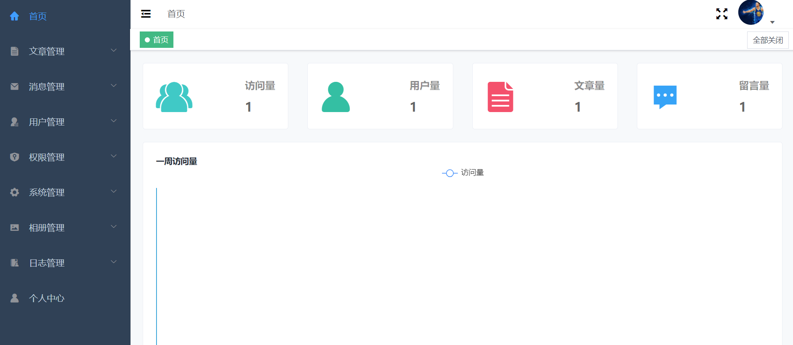

## 博客部署

### Docker安装运行环境

#### 1.安装Docker

```shell
yum install -y yum-utils device-mapper-persistent-data lvm2    #安装必要工具
yum-config-manager --add-repo http://mirrors.aliyun.com/docker-ce/linux/centos/docker-ce.repo #设置yum源
yum install -y docker-ce  #下载docker
systemctl start docker   #启动docker
```

#### 2.安装MySQL

```shell
docker pull mysql #下载MySQL镜像
docker run --name="mysql"  --restart=always -p 3306:3306 -e MYSQL_ROOT_PASSWORD=密码 -d mysql
```

#### 3.安装Redis

**注意：**docker拉取的redis没有配置文件，redis默认不允许远程连接，故要去官网下载配置文件以配置文件的形式启动。

1.拉取redis

```shell
docker pull redis #下载Redis镜像
```

2.去redis官网下个配置文件

官网地址 http://www.redis.cn/download.html

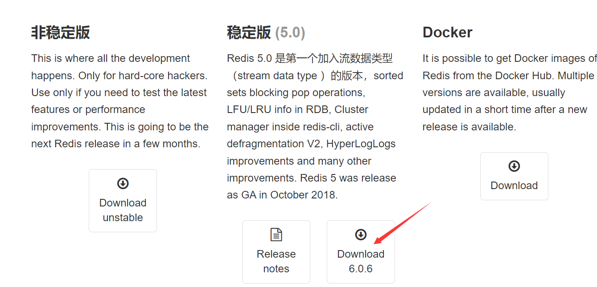

  3.下完后把 redis.conf 放 data/redis/  里,进行解压

```shell
mkdir /data/redis -pv
cd /data/redis/
tar -xvf redis-6.0.6.tar.gz
cd redis-6.0.6
cp redis.conf ..
```

4.然后修改 redis.conf 里面的参数

```
bind 0.0.0.0 #改成0.0.0.0，使redis可以外部访问

protected-mode no #默认yes，开启保护模式，限制为本地访问

daemonize no   #用守护线程的方式启动

requirepass 你的密码   #给redis设置密码

appendonly yes   #redis持久化　　默认是no
```

5.启动redis （示例）

```shell
docker run --name redis --restart=always -p 6379:6379 -v /data/redis/redis.conf:/etc/redis/redis.conf  -v /data/redis/data:/data -d redis redis-server /etc/redis/redis.conf --appendonly yes
```

`-p 6379:6379`:把容器内的6379端口映射到宿主机6379端口
`-v /data/redis/redis.conf:/etc/redis/redis.conf`：把宿主机配置好的redis.conf放到容器内的这个位置中
`-v /data/redis/data:/data`：把redis持久化的数据在宿主机内显示，做数据备份
`redis-server /etc/redis/redis.conf`：这个是关键配置，让redis不是无配置启动，而是按照这个redis.conf的配置启动
`–appendonly yes`：redis启动后数据持久化

6.启动完成后看一下是否启动成功 ，再进行远程连接。

```
docker ps
```

#### 4.安装nginx（请先部署项目再启动）

```shell
docker pull nginx #下载nginx镜像
docker run --name nginx --restart=always -p 80:80 -p 443:443 -d -v /usr/local/nginx/nginx.conf:/etc/nginx/nginx.conf -v /usr/local/vue:/usr/local/vue -v /usr/local/upload:/usr/local/upload nginx  #启动nginx，映射本地配置文件
```

#### 5.安装RabbitMQ

```shell
docker pull rabbitmq:management #下载RabbitMQ镜像
docker run --name="rabbit" --restart=always -p 15672:15672 -p 5672:5672  -d  rabbitmq:management  #启动RabbitMQ,默认guest用户，密码也是guest。
```

#### 6.选装环境（需2核4G）

##### 安装elasticsearch （可切换为MYSQL搜索）

```shell
docker pull elasticsearch:7.9.2 //下载elasticsearch镜像
docker run -d --restart=always -p 9200:9200 -p 9300:9300 --name elasticsearch elasticsearch:7.9.2 //启动elasticsearch
docker exec -it elasticsearch /bin/bash  //进入elasticsearch容器
./bin/elasticsearch-plugin install https://github.com/medcl/elasticsearch-analysis-ik/releases/download/v7.9.2/elasticsearch-analysis-ik-7.9.2.zip    //安装ik分词器
```

安装成功后使用postman创建索引

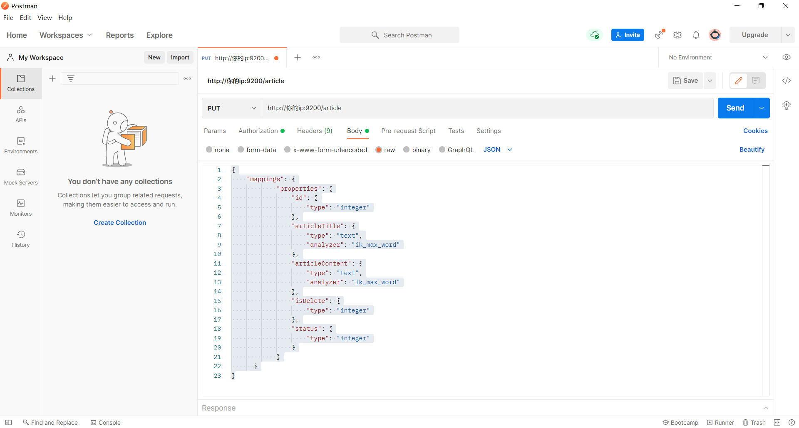

JSON参数

```
{
    "mappings": {
            "properties": {
                "id": {
                    "type": "integer"
                },
                "articleTitle": {
                    "type": "text",
                    "analyzer": "ik_max_word"
                },
                "articleContent": {
                    "type": "text",
                    "analyzer": "ik_max_word"
                },
                "isDelete": {
                    "type": "integer"
                },
                "status": {
                    "type": "integer"
                }
            }
      }
}
```

查看索引结构

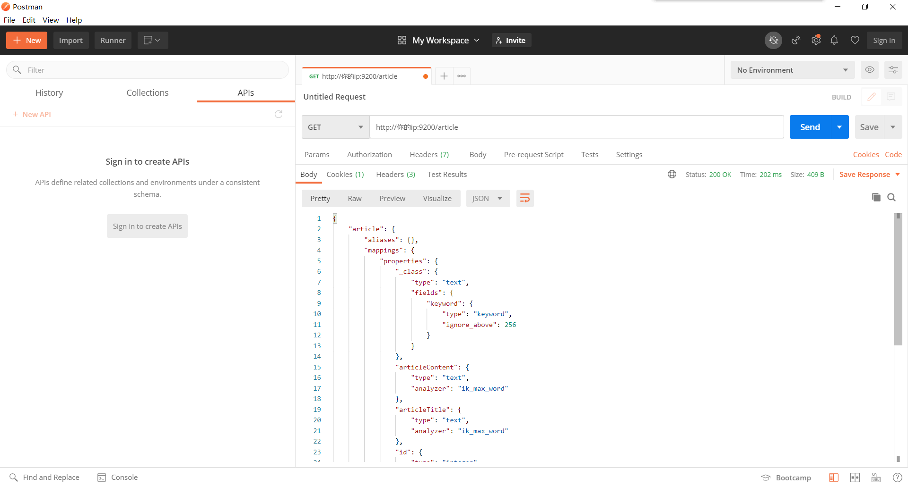

如图所示则创建成功

##### 安装MaxWell （ElasticSearch同步数据）

```shell
docker pull zendesk/maxwell //下载MaxWell镜像
docker run --name maxwell --restart=always  -d  zendesk/maxwell bin/maxwell  --user='数据库用户名' --password='数据库密码'  --host='IP地址'  --producer=rabbitmq --rabbitmq_user='MQ用户名' --rabbitmq_pass='MQ密码' --rabbitmq_host='IP地址' --rabbitmq_port='5672' --rabbitmq_exchange='maxwell_exchange'  --rabbitmq_exchange_type='fanout' --rabbitmq_exchange_durable='true' --filter='exclude: *.*, include: blog.tb_article.article_title = *, include: blog.tb_article.article_content = *, include: blog.tb_article.is_delete = *, include: blog.tb_article.status = *' //运行MaxWell
```

### 项目部署教程

#### 1.打包后端项目jar包

点击右侧maven插件 -> package将项目打成jar包

打包成功后会在target目录下生成jar包

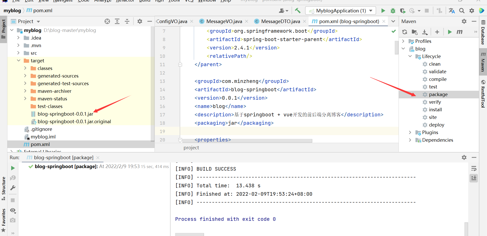

#### 2.编写Dockerfile文件

```shell
FROM java:8
VOLUME /tmp
ADD blog-springboot-0.0.1.jar blog.jar       
ENTRYPOINT ["java","-Djava.security.egd=file:/dev/./urandom","-jar","/blog.jar"] 
```

**注意：Dockerfile文件不需要后缀，直接为文件格式**

#### 3.编写blog-start.sh脚本

```shell
#源jar路径  
SOURCE_PATH=/usr/local/docker
#docker 镜像/容器名字或者jar名字 这里都命名为这个
SERVER_NAME=blog-springboot-0.0.1.jar
TAG=latest
SERVER_PORT=8080
#容器id
CID=$(docker ps | grep "$SERVER_NAME" | awk '{print $1}')
#镜像id
IID=$(docker images | grep "$SERVER_NAME:$TAG" | awk '{print $3}')
if [ -n "$CID" ]; then
  echo "存在容器$SERVER_NAME, CID-$CID"
  docker stop $CID
  docker rm $CID
fi
# 构建docker镜像
if [ -n "$IID" ]; then
  echo "存在$SERVER_NAME:$TAG镜像，IID=$IID"
  docker rmi $IID
else
  echo "不存在$SERVER_NAME:$TAG镜像，开始构建镜像"
  cd $SOURCE_PATH
  docker build -t $SERVER_NAME:$TAG .
fi
# 运行docker容器
docker run --name $SERVER_NAME -v /usr/local/upload:/usr/local/upload -d -p $SERVER_PORT:$SERVER_PORT $SERVER_NAME:$TAG
echo "$SERVER_NAME容器创建完成"
```

**注意：sh文件需要用notepad++转为Unix格式**

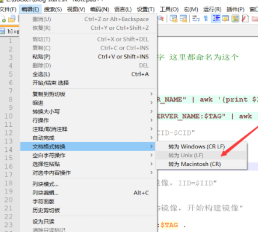

#### 4.将文件传输到服务器

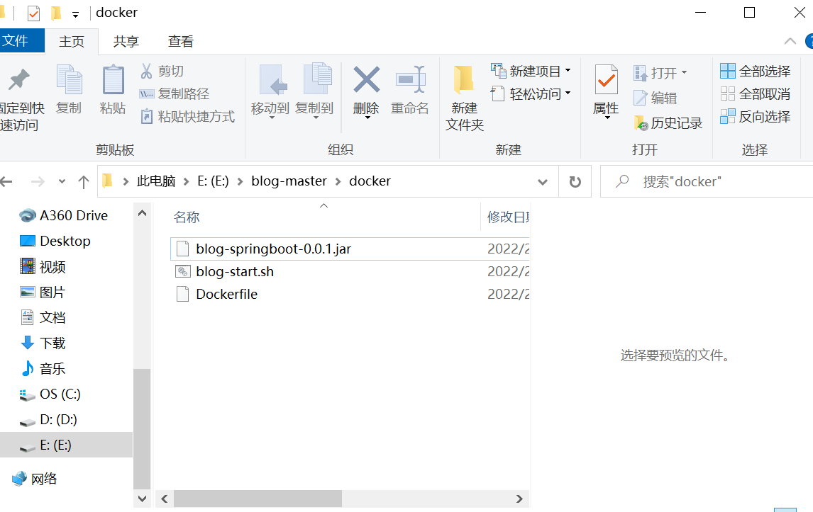

将上述三个文件传输到/usr/local/docker下（手动创建文件夹）

将文件拖动至空白区域即可

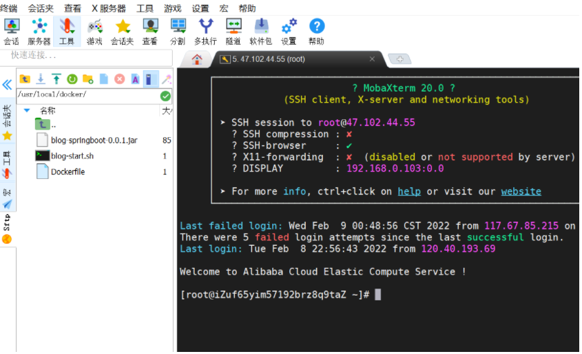

#### 5.docker运行后端项目

进入服务器/usr/local/docker下，构建后端镜像

```shell
cd /usr/local/docker
sh ./blog-start.sh
```

**注意：第一次时间可能比较长，耐心等待即可**

查看是否构建成功

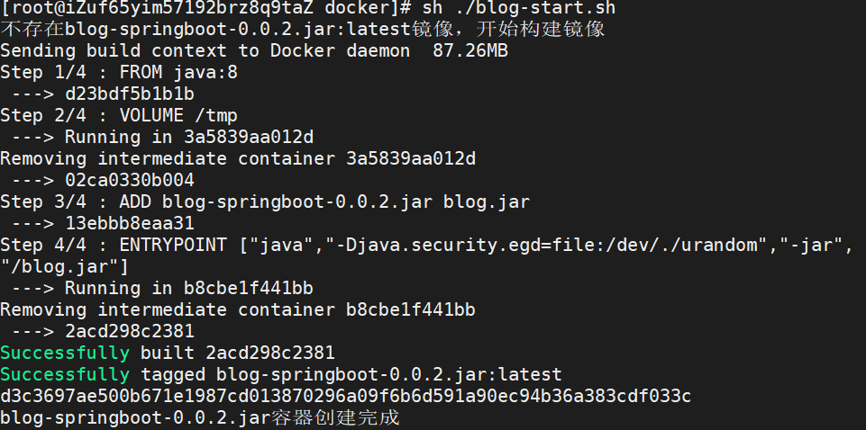

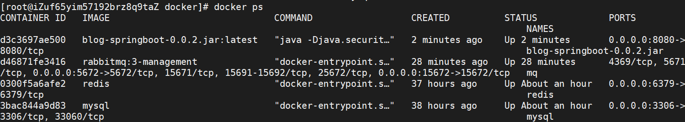

**注意：需要重新部署只需重新传jar包，执行sh脚本即可**

查看是否部署成功

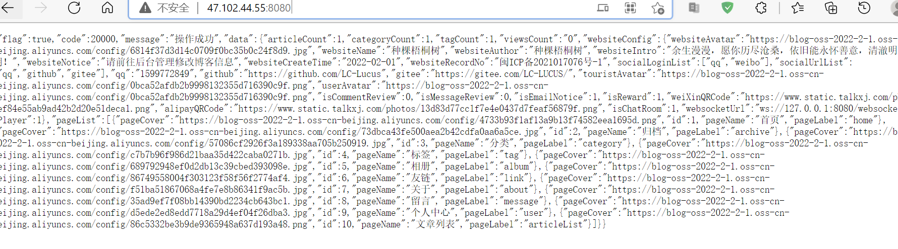

#### 6.打包前端项目

打开cmd，进入Vue项目路径 -> npm run build

成功后生成dist文件夹

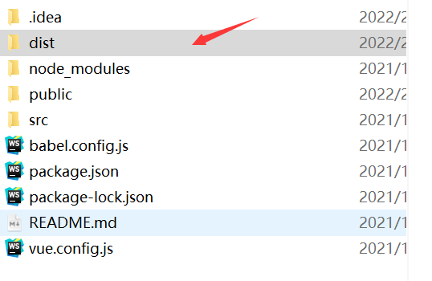

将Vue打包项目传输到/usr/local/vue下，并且改名。

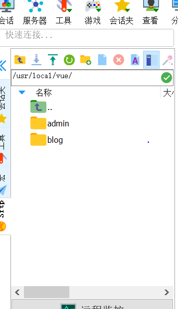

#### 7.nginx配置(有域名选这个)

**域名解析**

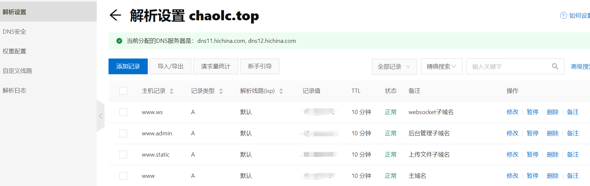

在/usr/local/nginx下创建nginx.conf文件，格式如下

```shell
events {
    worker_connections  1024;
}

http {
    include       mime.types;
    default_type  application/octet-stream;
    sendfile        on;
    keepalive_timeout  65;

    client_max_body_size     50m;
    client_body_buffer_size  10m; 
    client_header_timeout    1m;
    client_body_timeout      1m;

    gzip on;
    gzip_min_length  1k;
    gzip_buffers     4 16k;
    gzip_comp_level  4;
    gzip_types text/plain application/javascript application/x-javascript text/css application/xml text/javascript application/x-httpd-php image/jpeg image/gif image/png;
    gzip_vary on;

server {
        listen       80;
        server_name  前台域名;
     
        location / {		
            root   /usr/local/vue/blog;
            index  index.html index.htm; 
            try_files $uri $uri/ /index.html;	
        }
			
	location ^~ /api/ {		
            proxy_pass http://你的ip:8080/;
	    proxy_set_header   Host             $host;
            proxy_set_header   X-Real-IP        $remote_addr;						
            proxy_set_header   X-Forwarded-For  $proxy_add_x_forwarded_for;
        }
		
    }
	
server {
        listen       80;
        server_name  后台子域名;
     
        location / {		
            root   /usr/local/vue/admin;
            index  index.html index.htm; 
            try_files $uri $uri/ /index.html;	
        }
			
	location ^~ /api/ {		
            proxy_pass http://你的ip:8080/;
	    proxy_set_header   Host             $host;
            proxy_set_header   X-Real-IP        $remote_addr;						
            proxy_set_header   X-Forwarded-For  $proxy_add_x_forwarded_for;
        }
		
    }

server {
        listen       80;
        server_name  websocket子域名;
     
        location / {
          proxy_pass http://你的ip:8080/websocket;
          proxy_http_version 1.1;
          proxy_set_header Upgrade $http_upgrade;
          proxy_set_header Connection "Upgrade";
          proxy_set_header Host $host:$server_port;
          proxy_set_header X-Real-IP $remote_addr;
          proxy_set_header X-Forwarded-For $proxy_add_x_forwarded_for;
          proxy_set_header X-Forwarded-Proto $scheme;
       }
	
    }

server {
        listen       80;
        server_name  上传文件子域名;
     
        location / {		
          root /usr/local/upload/; 
        }		
		
    }
 
 }
```

**注意：我前台和后台时分为两个域名，所以写了两个server，前端项目路径为之前传输的路径，其他两个为文件上传域名和websocket转发域名。**

docker启动nginx服务

```shell
docker run --name nginx --restart=always -p 80:80 -d -v /usr/local/nginx/nginx.conf:/etc/nginx/nginx.conf -v /usr/local/vue:/usr/local/vue -v /usr/local/upload:/usr/local/upload nginx 
```

#### 8.nginx配置(无域名选这个)

```shell
events {
    worker_connections  1024;
}

http {
    include       mime.types;
    default_type  application/octet-stream;
    sendfile        on;
    keepalive_timeout  65;

    client_max_body_size     50m;
    client_body_buffer_size  10m; 
    client_header_timeout    1m;
    client_body_timeout      1m;

    gzip on;
    gzip_min_length  1k;
    gzip_buffers     4 16k;
    gzip_comp_level  4;
    gzip_types text/plain application/javascript application/x-javascript text/css application/xml text/javascript application/x-httpd-php image/jpeg image/gif image/png;
    gzip_vary on;

server {
        listen       80;
        server_name  你的ip;
     
        location / {		
            root   /usr/local/vue/blog;
            index  index.html index.htm; 
            try_files $uri $uri/ /index.html;	
        }
			
	location ^~ /api/ {		
            proxy_pass http://你的ip:8080/;
	    proxy_set_header   Host             $host;
            proxy_set_header   X-Real-IP        $remote_addr;						
            proxy_set_header   X-Forwarded-For  $proxy_add_x_forwarded_for;
        }
		
    }
	
server {
        listen       81;
        server_name  你的ip;
     
        location / {		
            root   /usr/local/vue/admin;
            index  index.html index.htm; 
            try_files $uri $uri/ /index.html;	
        }
			
	location ^~ /api/ {		
            proxy_pass http://你的ip:8080/;
	    proxy_set_header   Host             $host;
            proxy_set_header   X-Real-IP        $remote_addr;						
            proxy_set_header   X-Forwarded-For  $proxy_add_x_forwarded_for;
        }
		
    }

server {
        listen       82;
        server_name  你的ip;
     
        location / {
          proxy_pass http://你的ip:8080/websocket;
          proxy_http_version 1.1;
          proxy_set_header Upgrade $http_upgrade;
          proxy_set_header Connection "Upgrade";
          proxy_set_header Host $host:$server_port;
          proxy_set_header X-Real-IP $remote_addr;
          proxy_set_header X-Forwarded-For $proxy_add_x_forwarded_for;
          proxy_set_header X-Forwarded-Proto $scheme;
       }
	
    }

server {
        listen       83;
        server_name  你的ip;
     
        location / {		
          root /usr/local/upload/; 
        }		
		
    }
 
 }
```

docker启动nginx服务

```shell
docker run --name nginx --restart=always -p 80:80 -p 81:81 -p 82:82 -p 83:83 -d -v /usr/local/nginx/nginx.conf:/etc/nginx/nginx.conf -v /usr/local/vue:/usr/local/vue -v /usr/local/upload:/usr/local/upload nginx 
```

**注意：需要通过ip + 端口号访问项目**

#### 9.运行测试


#### 10.其他设置

进入后台管理 -> 系统管理 -> 网站管理 -> 其他设置，配置websocket地址，有域名则填ws://websocket域名，无域名则填ws://ip:82

## 博客监控

通过zabbix对博客使用的部分端口进行监控，检查网站的健康状况，如果发生异常，则通过邮件的方式对管理员进行通知。

### 安装zabbix 服务端

参考网址：https://www.zabbix.com/cn/download?zabbix=4.0&os_distribution=centos&os_version=7&db=mysql&ws=apache

- 准备yum源，安装服务的组件

```shell
# rpm -Uvh https://repo.zabbix.com/zabbix/4.0/rhel/7/x86_64/zabbix-release-4.0-2.el7.noarch.rpm
# yum clean all
```

- 安装Zabbix server，Web前端，agent

```shell
# yum install zabbix-server-mysql zabbix-web-mysql zabbix-agent -y
```

- 关闭selinux、防火墙

```shell
# setenforce 0
# systemctl stop firewalld
```

- 创建初始数据库

```shell
# yum install mariadb-server -y
# vim /etc/my.cnf	#这里修改mysql端口号以防和docker中的mysql端口发生冲突
[mysqld]
port=3606

# systemctl start mariadb
# mysql_secure_installation
# systemctl enable mariadb

# mysql -uroot -p
password
mysql> create database zabbix character set utf8 collate utf8_bin;
mysql> create user zabbix@localhost identified by '000000';
mysql> grant all privileges on zabbix.* to zabbix@localhost;
mysql> quit;
```

- 导入初始架构和数据，系统将提示您输入新创建的密码。

```shell
# zcat /usr/share/doc/zabbix-server-mysql*/create.sql.gz | mysql -uzabbix -p zabbix
```

- 为Zabbix server配置数据库

```shell
# vim /etc/zabbix/zabbix_server.conf
DBPassword=000000
```

- 编辑前端php配置

```shell
[root@server1 ~]# vim /etc/httpd/conf.d/zabbix.conf
php_value max_execution_time 300
php_value memory_limit 128M
php_value post_max_size 16M
php_value upload_max_filesize 2M
php_value max_input_time 300
php_value always_populate_raw_post_data -1
php_value date.timezone Asia/Shanghai

#修改httpd的端口否则会和nginx的80端口发生冲突
[root@server1 ~]# vim /etc/httpd/conf/httpd.conf
Listen 70
ServerAdmin IP地址:70
```

- 启动服务

```shell
# systemctl restart zabbix-server zabbix-agent httpd
# systemctl enable zabbix-server zabbix-agent httpd
```

- 至此完成zabbix 服务端的部署，可以通过http://IP:70/zabbix进行访问，初始化完成之后使用用户 Admin 密码zabbix

**记得向阿里云中添加安全组**

- 然后一路next

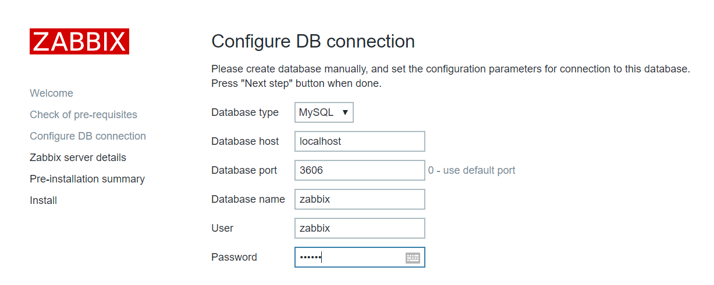

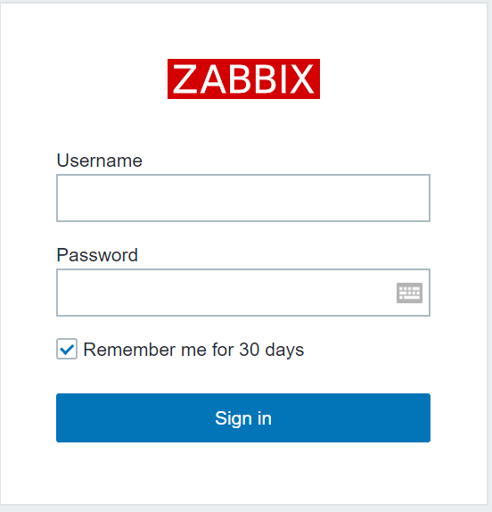

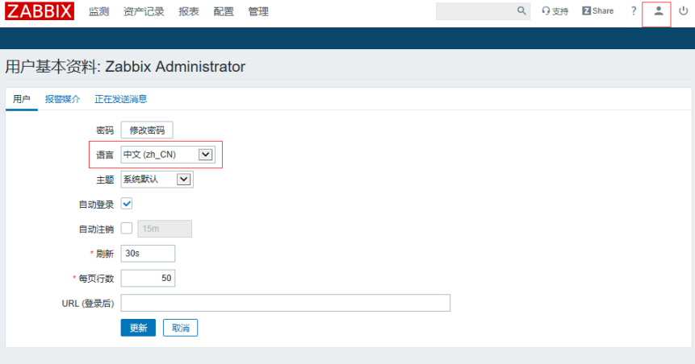

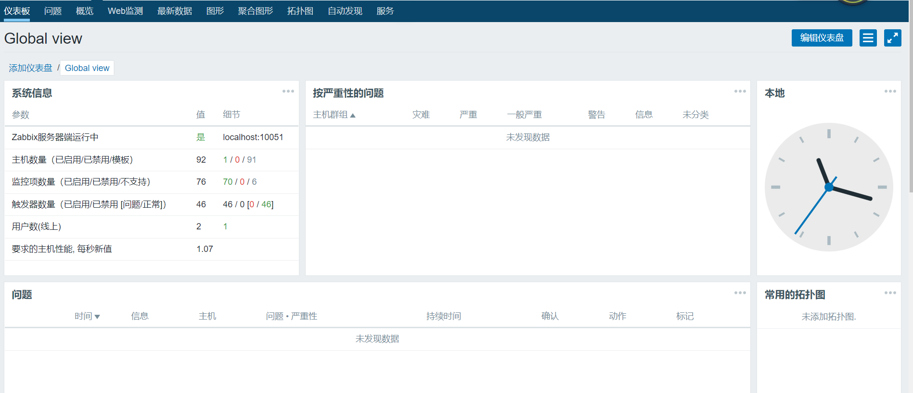

- 添加需要监控的主机

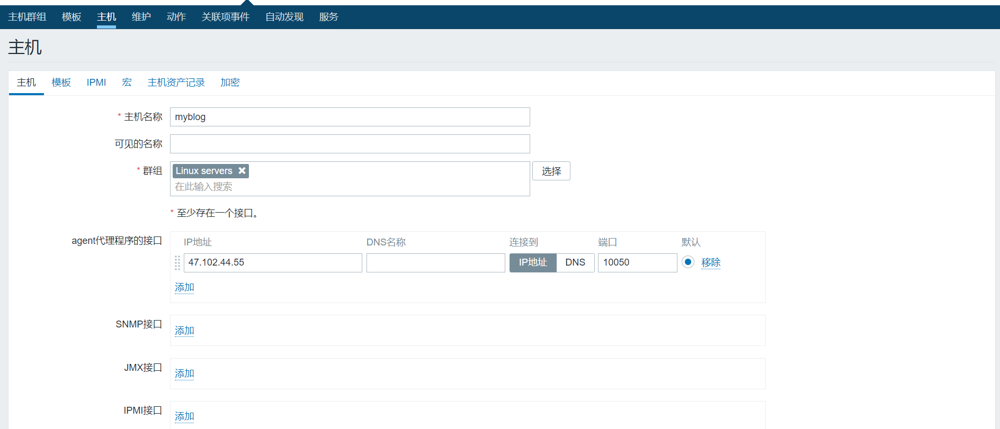

- 客户端配置

```shell
[root@server2 ~]# yum install zabbix-agent -y
[root@server2 ~]# vim /etc/zabbix/zabbix_agentd.conf	
# 主要修改以下三个参数,改成server的ip地址
Server=ip
ServerActive=ip
Hostname=myblog
```

- 端口监听

参考：https://blog.csdn.net/Jason160918/article/details/116000372

- 添加报警媒介

密码为qq授权码


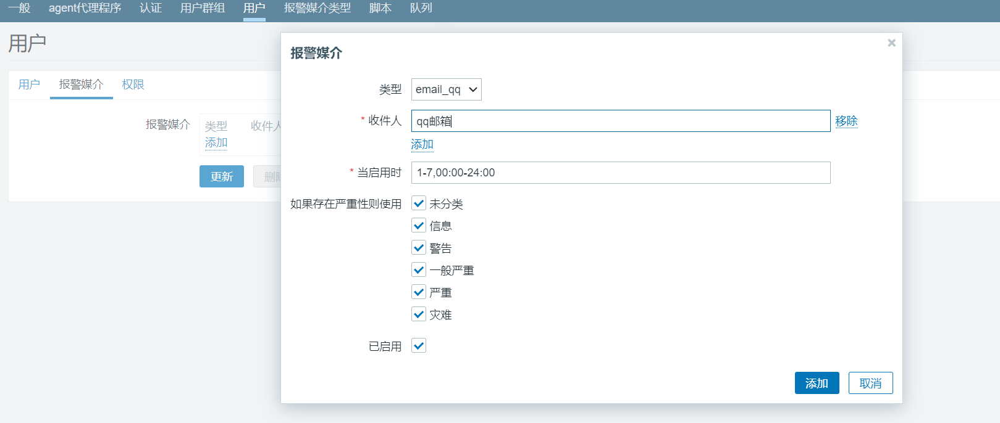

- 配置发送异常报警邮件：配置-》动作-》点击启用Report problems to Zabbix administrators即可。

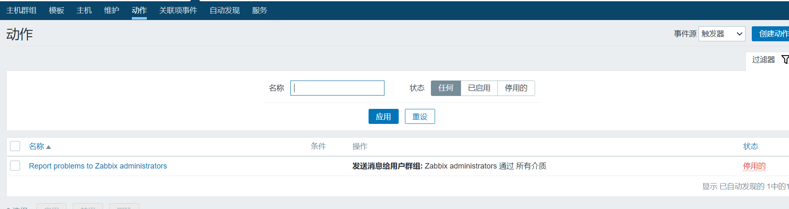

## 总结

本人抱着尝试与学习的态度初步完成这个博客项目，期间也参考了许多大牛的作品，借鉴了一些大佬们的创意，该项目用的都是比较新的技术，适合拿来练手，但是对初学者可能不太友好。项目中如果有什么不足之处，希望大家能够批评指正。
